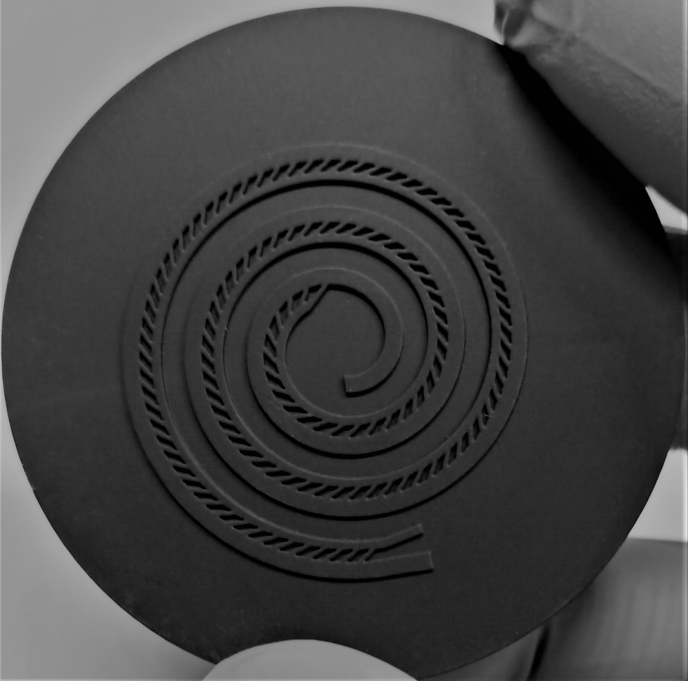

# SortOid
A microfluidic device to sort embryoid bodies by size.

It contains one inlet (center) and two outlets. The inner outlet contains objects smaller than the threshold limit defined by the dimension of the spirale and the sieves openings (here, 300µm).
To achieve better results, a second inlet to inject a secondary fluid (such as PBS) in order to focus the objects to the inner part of the spirale would increase the efficiency.

In this folder, you will find the template file to create a mold to be used with PDMS softlithography to produce a microfluidic device.
The .f3d file can be opened with Fusion360 and modified.
The .stl file can be printed.

The print from the picture was created using a Formlabs 3B+ SLA printer with the Black V4 resist.
